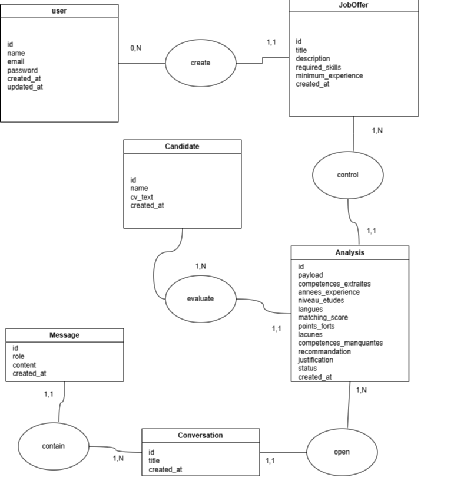
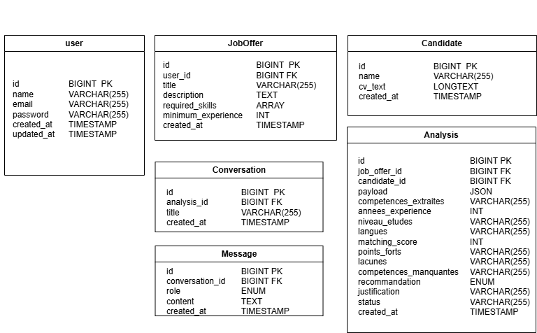

# TalentMatch — Assistant IA de Présélection RH


Assistant IA de présélection RH qui analyse les CV par rapport aux offres d'emploi via une architecture à deux couches : sortie structurée (JSON) et agent conversationnel avec mémoire persistante.

---

## Table des matières

- [Tech Stack](#tech-stack)
- [Prérequis](#prérequis)
- [Installation locale](#installation-locale)
- [Structure de la base de données](#structure-de-la-base-de-données)
- [Architecture IA](#architecture-ia)
- [Workflow de développement](#workflow-de-développement)
- [Tests](#tests)
- [Structure du projet](#structure-du-projet)
- [Variables d'environnement](#variables-denvironnement)
- [Changelog](#changelog)

---

## Tech Stack

| Couche | Package | Version |
|--------|---------|---------|
| Langage | PHP | 8.3 |
| Framework | Laravel | 13 |
| AI SDK | laravel/ai | 0.8 |
| Agents | laravel/boost | 2.4 |
| Auth | laravel/breeze | 2.4 |
| CSS | Tailwind CSS | 3 |
| JS | Alpine.js | 3 |
| Tests | pestphp/pest | 4.7 |
| Debug | Laravel Telescope | 5.20 |
| Logs | Laravel Pail | 1.2 |
| Linter | Laravel Pint | 1.27 |
| Base de données | MySQL | — |
| File d'attente | Database | — |

---

## Prérequis

- PHP 8.3 (XAMPP)
- Composer
- Node.js & npm
- MySQL (via XAMPP)
- Git

---

## Installation locale

```bash
git clone <repo>
cd talentmatch
composer install
npm install && npm run build
cp .env.example .env
```

### Configuration du `.env`

| Variable | Requise | Défaut | Description |
|----------|---------|--------|-------------|
| `GROQ_API_KEY` | Oui | — | Clé API LLM (Groq) |
| `DB_DATABASE` | Non | `talentmatch` | Nom de la base MySQL |
| `DB_USERNAME` | Non | `root` | Utilisateur MySQL |
| `DB_PASSWORD` | Non | — | Mot de passe MySQL |
| `QUEUE_CONNECTION` | Non | `database` | Driver de file d'attente |
| `MAIL_MAILER` | Non | `log` | Driver mail (dev) |

### Post-configuration

```bash
php artisan key:generate
php artisan vendor:publish --provider="Laravel\Ai\AiServiceProvider"
php artisan migrate
php artisan storage:link
```

### Lancer le worker

```bash
php artisan queue:work
```

> Les analyses IA sont asynchrones. Le worker doit tourner pour que les CV soumis soient traités.

---

## Structure de la base de données

Modèle Conceptuel de Données (MCD) et Modèle Logique de Données (MLD) :




### Tables principales

| Table | Description |
|-------|-------------|
| `users` | Utilisateurs (recruteurs) |
| `offres` | Offres d'emploi |
| `candidats` | Candidats soumis |
| `analyses` | Analyses IA (structured output) |
| `agent_conversations` | Conversations agent (créé par laravel/ai) |
| `agent_conversation_messages` | Messages de conversation (créé par laravel/ai) |
| `rdvs` | Rendez-vous d'entretien |

---

## Architecture IA

L'application utilise une architecture à deux couches distinctes :

### Couche 1 — Sortie structurée

Déclenchée à la soumission d'un CV via `StoreCandidatRequest` :

- **Job** : `AnalyseCvJob` (asynchrone, file `database`)
- **Contrat JSON** produit par le LLM :
  - `competences_extraites`, `annees_experience`, `niveau_etudes`, `langues`
  - `matching_score` (0-100)
  - `points_forts`, `lacunes`, `competences_manquantes`
  - `recommandation` (`convoquer` / `attente` / `rejeter`)
  - `justification`
- **Erreurs** : si le LLM retourne un JSON malformé → `status=failed`, message d'erreur affiché dans l'UI

### Couche 2 — Agent conversationnel

Déclenchée quand un recruteur envoie un message dans une conversation :

- **Mémoire** : trait `RemembersConversations` (persistance automatique via laravel/ai)
- **Pattern** : `forUser($user)->prompt()` pour démarrer, `continue($conversationId, as: $user)->prompt()` pour reprendre
- **Tools disponibles** :
  - `GetCandidateAnalysisTool` — récupérer l'analyse d'un candidat
  - `GetJobRequirementsTool` — récupérer les critères d'une offre
  - `CompareCandidatesTool` — comparer deux candidats sur une même offre
- **Règles** : jamais fabriquer de données, toujours appeler un tool, ne jamais exposer les données d'un autre utilisateur

---

## Workflow de développement

### Cycle OpenSpec

```
/opsx:propose <name>   →  Créer un changement (proposal → specs → design → tasks)
/opsx:apply            →  Implémenter les tâches
/opsx:archive          →  Archiver le changement (spec, tests verts, commit)
```

### Stratégie de branches

- Les branches suivent le format `featureAI/{kebab-case-title}`
- **Ne jamais pusher sur main** — l'utilisateur gère les merges vers main
- Les PRs sont créées depuis une branche `featureAI/*` vers `main`

### Messages de commit

```
type(scope): description [AI-assisted]
```

Exemple : `feat(agent): add CompareCandidatesTool [AI-assisted]`

---

## Tests

```bash
php artisan test --compact
```

### Règles

- Toutes les actions de contrôleur doivent avoir un test fonctionnel
- Les appels IA sont simulés avec `Agent::fake()` — aucun appel API réel
- Les jobs sont simulés avec `Queue::fake()`
- Pas de N+1 — vérifier avec Debugbar sur chaque vue liste
- Les données de test utilisent les factories des modèles

### Exemple de mock IA

```php
Agent::fake();

// Le SDK laravel/ai génère automatiquement des données
// conformes au schéma JSON de l'agent structuré

AgentName::assertPrompted();
AgentName::assertQueued();
```

---

## Structure du projet

```
app/
  Ai/
    Agents/          — Classes agent conversationnel
    Providers/       — Providers LLM (AnalyseCv, etc.)
    Tools/           — Définitions des tools
  Jobs/
    AnalyseCvJob.php — Analyse asynchrone structurée
config/
  ai.php             — Configuration AI SDK
openspec/
  changes/           — Archives des changements
  config.yaml        — Configuration centrale (conventions, permissions)
  specs/             — Spécifications des fonctionnalités
resources/views/     — Templates Blade
routes/              — Routes web
tests/               — Tests Pest (Feature + Unit)
```

---

## Variables d'environnement

| Variable | Requise | Défaut | Description |
|----------|---------|--------|-------------|
| `GROQ_API_KEY` | Oui | — | Clé API LLM (Groq) |
| `DB_DATABASE` | Non | `talentmatch` | Nom de la base MySQL |
| `DB_USERNAME` | Non | `root` | Utilisateur MySQL |
| `DB_PASSWORD` | Non | — | Mot de passe MySQL |
| `QUEUE_CONNECTION` | Non | `database` | Driver de file d'attente |
| `MAIL_MAILER` | Non | `log` | Driver mail (dev) |

---

## Changelog

Les changements sont documentés dans [`openspec/changes/`](openspec/changes/). Chaque répertoire contient le proposal, la spec, le design et les tâches de chaque changement implémenté. Naviguer par nom de fonctionnalité ou par date.
